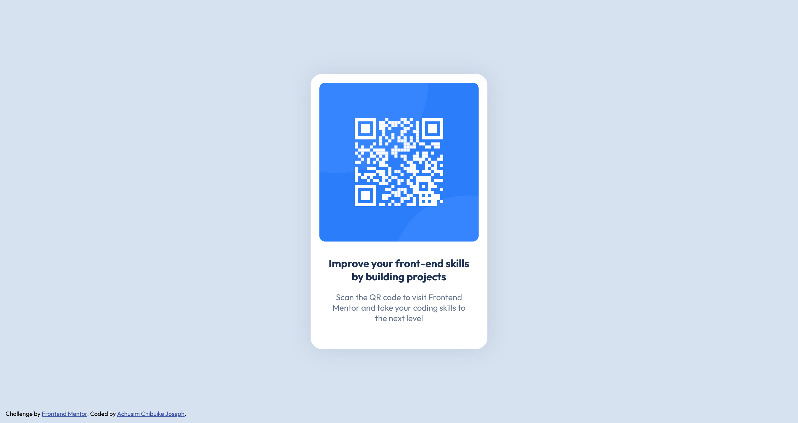

# Frontend Mentor - QR code component solution

This is a solution to the [QR code component challenge on Frontend Mentor](https://www.frontendmentor.io/challenges/qr-code-component-iux_sIO_H). Frontend Mentor challenges help you improve your coding skills by building realistic projects.

## Table of contents

- [Overview]
  - [Screenshot]
  - [Links]
- [My process] 
  - [Built with]
  - [What I learned]
  - [Continued development]
  - [Useful resources]
- [Author]

## Overview

A solution to the FrontendMentor newbie challenge on the Progress Path.

### Screenshot

### Links

- Live Site URL: (https://perfexion17.github.io/frontentmentor_qrcode/)

## My process

- Created a div with class "wrap" to wrap the whole section of the QR code.
- Created a div with class "qr" for the QR code inside the wrap div.
- Created a div with the class of "text" for the texts inside the wrap div.
- Centered .wrap.
- Applied the relevant dimensions to the image and .wrap.
- Applied all relevant styles(font size, font weight, text align, font family)

### Built with

- Semantic HTML5 markup
- CSS custom properties
- Mobile-first workflow

### What I learned

I didn't learn anything new. Rather, I was able to reinforce my knowledge and skills with HTML and CSS.

### Continued development

I want to keep buikding and getting better with the position attribute.

## Author

- Frontend Mentor - [@PERFEXION17](https://www.frontendmentor.io/profile/PERFEXION17)
- Twitter - [@Jo_Seph17](https://www.x.com/Jo_Seph17)